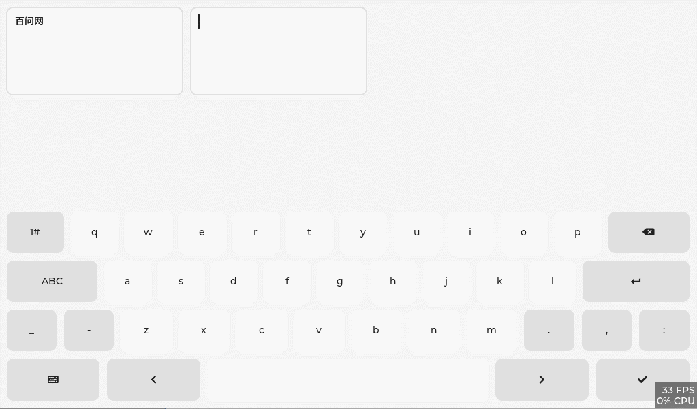

⚠️ This library is now obsolete. Please use https://github.com/100askTeam/lv_lib_100ask/tree/master/src/lv_100ask_chinese_ime instead. ⚠️

<h1 align="center"> lv_chinese_ime</h1>

<p align="center">

</p>

<p align="center">
lv_chinese_ime is a custom component written on the basis of lv_keyboard, it is no different from lv_keyboard, but the function of supporting Chinese input method (Pinyin) is added.
</p>


**English** | [中文](./README_zh.md) |


# Introduction

`lv_chinese_ime` is a custom component written on the basis of lv_keyboard (the creation interface is: `lv_chinese_ime_create(lv_obj_t *parent));` ), it is no different from [lv_keyboard](https://docs.lvgl.io/master/widgets/extra/keyboard.html), but the function of supporting Chinese input method (Pinyin) is added.

So we call it: **Support Chinese input method LVGL keyboard (lv_keyboard) widget enhancement plugin**.

Normally, as long as lvgl can run in an environment `lv_chinese_ime` can also run! There are two main influencing factors: the size of the font file used and the size of the thesaurus used.

`lv_chinese_ime` is very simple to use, and the subsequent custom expansion functions are also very convenient, so stay tuned for more functions.


# Usage

1. Clone this repository:  `https://github.com/100askTeam/lv_chinese_ime.git`
2. The `lv_chinese_ime` directory should be next to the `lvgl` directory in your project.
Similarly to `lv_conf.h` there is a configuration file for the examples too. It is called `lv_chinese_ime_conf.h`.
3. Copy `lv_chinese_ime/lv_chinese_ime_conf_template.h` next to `lv_chinese_ime` directory
4. Rename it to `lv_chinese_ime_conf.h`
5. Change the first `#if 0` to `#if 1` to enable the file's content
6. Enable or Disable function
7. To prepare a font file or thesaurus file, read more:  [lv_chinese_ime/test/README.md](test/README.md)
8. Use example:

```c
/*declare font*/
LV_FONT_DECLARE(lv_font_source_han_sans_bold_14);

static void ta_event_cb(lv_event_t * e)
{
    lv_event_code_t code = lv_event_get_code(e);
    lv_obj_t * ta = lv_event_get_target(e);
    lv_obj_t * kb = lv_event_get_user_data(e);

    if(code == LV_EVENT_FOCUSED) {
        if(lv_indev_get_type(lv_indev_get_act()) != LV_INDEV_TYPE_KEYPAD) {
            lv_keyboard_set_textarea(kb, ta);
            lv_obj_set_style_max_height(kb, LV_HOR_RES * 2 / 3, 0);
            lv_obj_clear_flag(kb, LV_OBJ_FLAG_HIDDEN);
            lv_obj_scroll_to_view_recursive(ta, LV_ANIM_OFF);
        }
    }
    else if(code == LV_EVENT_READY || code == LV_EVENT_CANCEL) {
        lv_obj_add_flag(kb, LV_OBJ_FLAG_HIDDEN);
        lv_obj_clear_state(ta, LV_STATE_FOCUSED);
        lv_indev_reset(NULL, ta);   /*To forget the last clicked object to make it focusable again*/
    }
}

void your_test_function(void)
{
    lv_obj_t * kb = lv_chinese_ime_create(lv_scr_act());
    lv_chinese_ime_set_text_font(&lv_font_source_han_sans_bold_14, 0);   // set font
    //lv_chinese_ime_set_dict(your_dict); // Use a custom thesaurus. If it is not set, the built-in thesaurus will be used


    /* ta1 */
    lv_obj_t * ta1 = lv_textarea_create(lv_scr_act());
    lv_obj_set_style_text_font(ta1, &lv_font_source_han_sans_bold_14, 0);   // set font
    lv_obj_align(ta1, LV_ALIGN_TOP_LEFT, 10, 10);

    lv_keyboard_set_textarea(kb, ta1);

    lv_obj_add_event_cb(ta1, ta_event_cb, LV_EVENT_ALL, kb);

    /* ta2 */
    lv_obj_t * ta2 = lv_textarea_create(lv_scr_act());
    lv_obj_set_style_text_font(ta2, &lv_font_source_han_sans_bold_14, 0);   // set font
    lv_obj_align_to(ta2, ta1,LV_ALIGN_OUT_RIGHT_MID, 10, 0);

    lv_obj_add_event_cb(ta2, ta_event_cb, LV_EVENT_ALL, kb);
}
```


# NOTE
- Only one `lv_chinese_ime` can exist in a project at the same time.
- When `lv_chinese_ime` is not needed, please use `lv_chinese_ime_del` to delete it.
- After deleting `lv_chinese_ime` normally, you can recreate the usage through the [above](# Usage) usage example..


# About
This is an open project and contribution is very welcome!
Contact us: smilezyb@163.com
